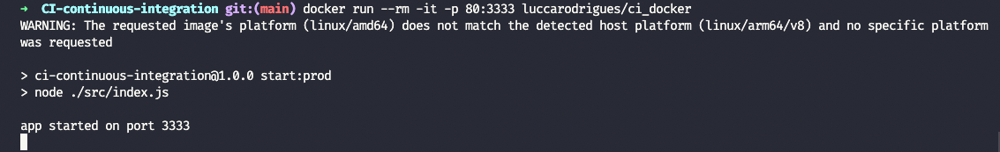
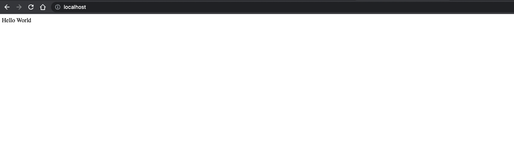

## Build da imagem local:

- Executar `docker build -t ci_docker .` para fazer o build da imagem
- Rodar o comando `docker run --rm -it -p 80:3333 ci_docker` para executar a imagem local na porta `80` e em seguida remove-la

## Build da imagem em produção:

- Executar o comando `docker run --rm -it -p 80:3333 luccarodrigues/ci_docker` para executar diretamente a imagem com a versão que está em produção consumindo na porta `80` da máquina local.

## Syncronizar imagem local:

- Executar `docker pull luccarodrigues/ci_docker` e em seguida executar como na etapa anterior.

## DOC

- Ao executar a API, será exibido um console do app rodando dentro do docker
  
  
